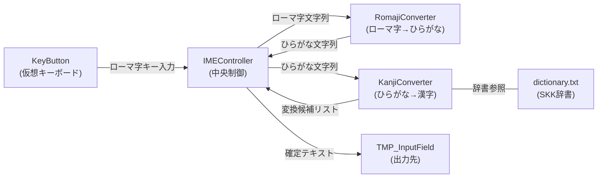

# VRCJapaneseInputSystem プロジェクトドキュメント

VRChat向けに開発された、**UdonSharp + SKK辞書ベースの日本語入力システム（IME）** です。
仮想キーボードからローマ字入力し、ひらがな→漢字変換をVRChat内で完結させます。

---

## アーキテクチャ概要



### 変換パイプライン

1. **ユーザー** → 仮想キーボード(`KeyButton`)のキーを押す
2. **KeyButton** → `IMEController`にイベント送信（`SendCustomEvent`経由）
3. **IMEController** → `RomajiConverter`にローマ字を渡す
4. **RomajiConverter** → ローマ字をひらがなにリアルタイム変換
5. **ユーザーがSpaceを押す** → `IMEController`が`KanjiConverter`に変換を依頼
6. **KanjiConverter** → SKK辞書を検索し候補リストを返す
7. **ユーザーがEnterを押す** → 選択中の候補を確定し出力

---

## コンポーネント詳細

### 1. IMEController（[IMEController.cs](file:///home/kei/ドキュメント/VRCJapaneseInputSystem/Scripts/IMEController.cs)）

**役割**: システム全体の中央制御。入力状態管理、UI表示更新、テキスト出力を担当。

| 項目 | 内容 |
|------|------|
| **状態** | `STATE_INPUT`（入力中）/ `STATE_CONVERT`（変換中）の2状態 |
| **依存** | `RomajiConverter`, `KanjiConverter`, TextMeshPro UI要素 |
| **出力先** | `TMP_InputField`（オプション） |

**主要なイベントハンドラ**:

| メソッド | トリガー | 動作 |
|----------|----------|------|
| `_OnInputKey()` | 文字キー押下 | ローマ字バッファに追加 / 変換中は候補の数字選択（ページ対応） |
| `_OnSpace()` | Spaceキー | 入力→変換開始 / 変換中→次の候補 |
| `_OnEnter()` | Enterキー | テキスト確定・出力 |
| `_OnBackspace()` | BSキー | 入力→1文字削除 / 変換→キャンセル |
| `_OnShrinkSegment()` | ◀キー | 変換セグメントを1文字短縮 |
| `_OnExtendSegment()` | ▶キー | 変換セグメントを1文字延長 |
| `_OnCommitHiragana()` | ひらがな確定 | 現在のセグメントをひらがなのまま確定 |
| `_OnCommitKatakana()` | カタカナ確定 | 現在のセグメントをカタカナに変換して確定 |
| `_ToggleIME()` | IMEキー | IME ON/OFF切替（表示: あ/A） |

**UI表示の視覚的フィードバック**:

- **セグメントハイライト**: 変換中のアクティブセグメントを**黄色下線**で強調表示し、残りの未変換読みを**灰色**で表示。確定済み・変換中・未変換が一目で判別可能。
- **候補のページング表示**: 変換候補を9件ずつページ単位で表示。10件以上の候補がある場合はSpaceキーで自動的にページが切り替わり、`[1/3]` のようなページインジケーターを表示。数字キーによる候補選択もページオフセットに対応。

**セグメント処理フロー**:
変換時、文節が残る場合は残りの読みで自動的に再変換をチェーンし、全セグメント確定で一括出力する。

---

### 2. RomajiConverter（[RomajiConverter.cs](file:///home/kei/ドキュメント/VRCJapaneseInputSystem/Scripts/RomajiConverter.cs)）

**役割**: QWERTY配列ローマ字入力をリアルタイムでひらがなに変換。

**変換テーブル**: 約160パターン（4文字→1文字の順で最長一致）

| パターン長 | 例 | 変換結果 |
|------------|------|----------|
| 4文字 | `ltsu`, `xtsu` | っ |
| 3文字 | `sha`, `chi`, `kya` | しゃ, ち, きゃ |
| 2文字 | `ka`, `nn` | か, ん |
| 1文字 | `a`, `i` | あ, い |

**特殊処理**:
- **促音**: 同じ子音の連続（例: `kk` → `っk`）
- **撥音**: `n` + 子音（`a/i/u/e/o/y/n`以外）→ `ん`
- **長音**: `-` → `ー`
- **コミット時**: 残った `n` を `ん` に変換

---

### 3. KanjiConverter（[KanjiConverter.cs](file:///home/kei/ドキュメント/VRCJapaneseInputSystem/Scripts/KanjiConverter.cs)）

**役割**: ひらがなの読みをSKK辞書から漢字候補に変換。

**辞書構造**: 並列配列（Udon最適化）
```
dictionaryKeys[i]   = "よみ"     (例: "にほん")
dictionaryValues[i] = "候補1,候補2,..." (例: "日本,二本")
```

**変換アルゴリズム（3段階）**:

1. **完全一致**: 読み全体が辞書キーと一致するかを**二分探索（O(log N)）**で検索。一致すればそのまま使用。
2. **2ステップ先読み付きプレフィックスマッチ**:
   - プレフィックス一致を前方から順に部分文字列として生成し、二分探索で収集（最大30件）
   - 各プレフィックスについて `score = prefix_len + next_segment_len` を計算
   - スコア最大のものを選択（同スコアならプレフィックスが短い方＝助詞分離に有利）
3. **フォールバック**: 辞書一致なし → ひらがなそのまま（＋カタカナ候補）

**候補表示順**: 辞書最頻候補 → ひらがな → 辞書の他候補 → カタカナ

**セグメント長手動調整**: `ShrinkSegment()` / `ExtendSegment()` で1文字ずつ伸縮可能。

> [!IMPORTANT]
> .NETのカルチャ依存比較（`ー U+30FC` が `は U+306F` に誤一致する問題）を回避しつつ、Udon環境で高速な二分探索を実現するため、独自の文字コード比較メソッド `CompareOrdinal()` を実装して検索に用いています。

---

### 4. KeyButton（[KeyButton.cs](file:///home/kei/ドキュメント/VRCJapaneseInputSystem/Scripts/KeyButton.cs)）

**役割**: 仮想キーボードの個々のキーUIを制御。

**キータイプ定義**:

| keyType | 種類 | 表示ラベル | 動作 |
|---------|------|-----------|------|
| 0 | 通常文字 | A〜Z, 0〜9等 | `_OnInputKey` に `keyValue` を送信 |
| 1 | Space | Space | `_OnSpace`（変換/次候補） |
| 2 | Enter | ↵ | `_OnEnter`（確定） |
| 3 | Backspace | ← | `_OnBackspace` |
| 4 | Escape | Esc | `_OnEscape` |
| 5 | IME Toggle | あ/A | `_ToggleIME`（あ/A切替 + **キー背景色が緑/標準に変化**） |
| 6 | Shift | ⇧ | 全キーの大文字/小文字切替 |
| 7 | ◀ セグメント短縮 | ◀ | `_OnShrinkSegment` |
| 8 | ▶ セグメント延長 | ▶ | `_OnExtendSegment` |
| 9 | ひらがな確定 | ひら | `_OnCommitHiragana` |
| 10 | カタカナ確定 | カナ | `_OnCommitKatakana` |

**フィードバック機能**:

- **視覚フィードバック**: キー押下時に `FlashKey()` で一瞬色が変化。IMEキーはON時に背景が**緑色**に変わり、OFF時に標準色に戻る。
- **音声フィードバック**: `AudioSource`（`keyClickAudio`）が設定されている場合、キー押下時にクリック音を `PlayOneShot()` で再生。VR空間での打鍵感を向上。

**VRChat連携**: `Interact()` をオーバーライドし、VRCのインタラクションイベントに対応。
ボタンクリックは `UdonBehaviour.SendCustomEvent` 経由で `IMEController` のメソッドを呼ぶ。

---

## Editorツール

### IMESetupTool（[IMESetupTool.cs](file:///home/kei/ドキュメント/VRCJapaneseInputSystem/Editor/IMESetupTool.cs)）

**メニュー**: `Tools > Japanese IME > Setup Helper`

仮想キーボードのPrefabに対して以下を一括設定:
- `Key_xxx` 命名規則からキー値・タイプを自動推定（`Shift`, `ShrinkSeg`, `ExtendSeg`, `Hiragana`, `Katakana` にも対応）
- `KeyButton` コンポーネントの自動アタッチ
- `IMEController` 参照の割り当て
- ボタンの `OnClick` に `UdonBehaviour.Interact()` を登録
- UI表示要素（`InputText`, `CandidateText`, `IMEStatus`）の自動リンク

---

### VirtualKeyboardGenerator（[VirtualKeyboardGenerator.cs](file:///home/kei/ドキュメント/VRCJapaneseInputSystem/Editor/VirtualKeyboardGenerator.cs)）

**メニュー**: `Tools > Japanese IME > Generate Virtual Keyboard`

QWERTY配列の仮想キーボードUIを自動生成:
- World Space Canvas + 5段キー配列（文字4段 + 機能キー段）
- 機能キー段: `IME(あ/A)`, `◀(文節短縮)`, `Space`, `▶(文節延長)`, `ひら(ひらがな確定)`, `カナ(カタカナ確定)`
- 入力表示エリア・候補表示エリア・IMEステータス表示
- キーサイズ・間隔・Canvas寸法がカスタマイズ可能
- ルートオブジェクトに3D対応の `AudioSource` を自動付与（キークリック音用、AudioClipはInspectorから任意設定）

---

### SKKDictionaryConverter（[SKKDictionaryConverter.cs](file:///home/kei/ドキュメント/VRCJapaneseInputSystem/Editor/SKKDictionaryConverter.cs)）

**メニュー**: `Tools > Japanese IME > Download SKK Dictionary`

`SKK-JISYO.L` をGitHubからダウンロードし、Udon用のTSV形式に変換:
- **入力**: SKK形式（EUC-JP、`よみ /候補1/候補2/`）
- **出力**: `dictionary.txt`（UTF-8、`よみ\t候補1,候補2`） **※ランタイムでの二分探索用にキーのOrdinal昇順でソート済み**
- 送り仮名付きエントリやアノテーションを除去

---

## ディレクトリ構成

```
VRCJapaneseInputSystem/
├── Scripts/                    ... ランタイムスクリプト (UdonSharp)
│   ├── IMEController.cs        ... 中央制御（483行）
│   ├── KanjiConverter.cs       ... かな漢字変換（432行）
│   ├── RomajiConverter.cs      ... ローマ字→ひらがな変換（290行）
│   └── KeyButton.cs            ... キーボタンUI制御（216行）
├── Editor/                     ... Unity Editorツール
│   ├── IMESetupTool.cs         ... Prefab自動セットアップ
│   ├── VirtualKeyboardGenerator.cs ... キーボードUI生成
│   └── SKKDictionaryConverter.cs   ... SKK辞書ダウンロード＆変換
├── Prefabs/                    ... Unity Prefab
│   ├── JapaneseIME.prefab      ... IMEコア
│   ├── VirtualKeyboard.prefab  ... キーボード単体
│   ├── v0.2/                   ... v0.2 統合プレハブ
│   ├── v0.3/                   ... v0.3 統合プレハブ
│   └── 完成品/                 ... 完成版プレハブ各種
├── Resources/
│   ├── dictionary.txt          ... 変換辞書（SKK-JISYO.L由来、gitignore済み）
│   └── SKK_COPYRIGHT.txt       ... SKK辞書の著作権情報
├── LICENSE                     ... MIT License（プログラム部分）
└── README.md                   ... プロジェクト説明
```

---

## ライセンス構成

| 対象 | ライセンス | 備考 |
|------|-----------|------|
| ソースコード・Prefab・Unityアセット | **MIT License** | 商用利用可、プロプライエタリアセットとの混在OK |
| `dictionary.txt`（SKK辞書データ） | **GPL v2+** | プログラムは外部データとして読み込むため、GPL汚染なし |

> [!NOTE]
> この二重ライセンス構成により、VRChatワールド制作者は有料アセットと組み合わせてビルド・公開が可能です。辞書は「単なる集積（mere aggregation）」として扱われます。

---

## 技術的特徴

- **Udon制約への対応とパフォーマンス**: ジェネリクス、LINQ不使用。並列配列で辞書を管理。また、変換時のループ負荷をなくすため、事前にソートされた辞書を**O(log N)の二分探索**で検索するよう最適化。
- **2ステップ先読み分節**: 貪欲最長一致ではなく、次の文節との合計長を評価し、助詞（は・が・を）の正しい分離を実現。
- **カスタムOrdinal比較**: .NETカルチャ依存のStartsWith等による誤一致を避け、GCを発生させずに高速な文字列比較を行う `CompareOrdinal` メソッドを自作して二分探索を支えている。
- **セグメント手動調整**: 変換中にユーザーが◀▶キーで文節長を伸縮可能。
- **ひらがな/カタカナ直接確定**: 変換中でも専用キー（ひら/カナ）でひらがな・カタカナとして即時確定可能。
- **変換セグメントのリッチテキスト表示**: 変換中のアクティブセグメントを黄色下線、残りの読みを灰色で表示し、操作対象を視覚的に明確化。
- **候補ページング**: 変換候補を9件単位でページ表示し、ページインジケーター `[n/m]` を付与。数字キーによる選択もページオフセットに対応。
- **音声フィードバック**: キー打鍵時に `AudioSource.PlayOneShot()` でクリック音を再生可能（AudioClipは任意設定）。VR空間での入力体感を向上。
- **IMEキーの状態色表示**: IME ON時にトグルキーの背景色が緑に変化し、現在のIME状態を即座に視認可能。
